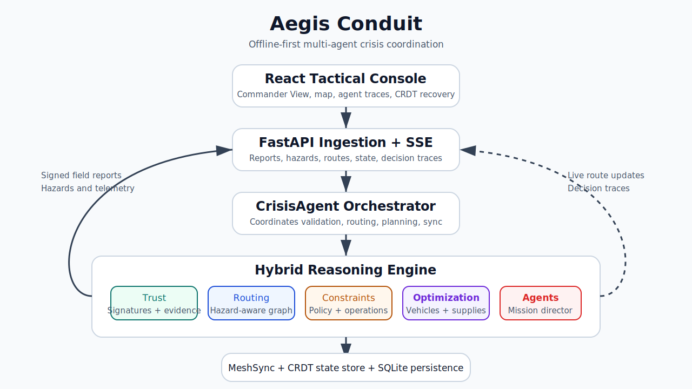

<<<<<<< HEAD
# Aegis Conduit

**Aegis Conduit is an offline-first crisis coordination system for humanitarian logistics when cloud, telecom, and centralized command infrastructure are unreliable.**

It is built for the Agents League hackathon as a multi-agent operations console, not a chatbot. Aegis verifies field reports, rejects misinformation, re-ranks evacuation corridors, reallocates supplies, generates an operator-readable mission plan, and keeps state recoverable through local mesh synchronization.

## Why It Matters

During disasters, conflict zones, and infrastructure outages, responders still need answers:

- Which field reports can be trusted?
- Which evacuation routes are still safe?
- Where should medical supplies and convoys go next?
- What happens when the cloud link drops?

Aegis Conduit turns fragmented field signals into a signed, auditable mission briefing that can keep operating offline.

## What Works End-to-End

The repository includes a deterministic local proof path, not just architecture diagrams:

```text
Unsigned spoofed report
-> rejected by veracity engine
-> authority-signed report verified with Ed25519 public key
-> trusted hazard changes route ranking
-> commander produces a mission plan
-> resource optimizer assigns loads
-> mesh replicas gossip and merge CRDT state
```

Run it:

```powershell
python scripts/full_demo.py
```

Expected proof points from the script:

- Spoofed report rejected with `crypto_valid: false`.
- Authority-signed report accepted with `trusted: true`, `crypto_valid: true`, and `confidence: 1.0`.
- Checkpoint route is demoted after the trusted road-block report.
- Mission phases and resource assignments are generated.
- Two mesh replicas converge after offline gossip, with CRDT keys merged.

## Hybrid Reasoning Engine

Aegis uses a hybrid reasoning architecture rather than treating "AI" as a label:

1. Trust Reasoning
   - Signature validation
   - Reputation scoring
   - Evidence corroboration
2. Graph Reasoning
   - Hazard-aware route evaluation
   - Alternative corridor generation
3. Constraint Reasoning
   - Policy and operational constraints
   - Mission feasibility checks
4. Optimization Reasoning
   - Vehicle routing
   - Supply assignment
5. Multi-Agent Reasoning
   - Verification Agent
   - Routing Agent
   - Logistics Agent
   - Mission Director

```text
Trusted Reports
        |
Evidence Evaluation
        |
Route Analysis
        |
Resource Optimization
        |
Mission Plan Generation
```

## Demo Benchmark

The local benchmark is intentionally small and reproducible so judges can run it on any laptop:

```text
Scenario:
- 1 spoofed hazard report
- 1 authority-signed road-block report
- 3 candidate evacuation routes
- 3 vehicles / supply loads
- 2 offline mesh replicas

Results:
- Spoofed report rejection: 100% in the deterministic demo
- Signed authority acceptance: 100% in the deterministic demo
- Route re-ranking: checkpoint corridor demoted after trusted hazard
- Resource assignment: generated through OR-Tools or capacity-aware fallback
- CRDT recovery: both replicas converge after gossip
```

`python scripts/full_demo.py` also prints timing metrics for spoof rejection, signed-report-to-route ranking, resource assignment, and mesh merge.

## Judge Demo Flow

Recommended 5-minute live sequence:

1. Start the app with Docker Compose or local dev commands below.
2. Open the React console.
3. Click **Run Trust Demo** to show fake report rejection and signed authority acceptance.
4. Click **Simulate Bridge Failure** to show route re-ranking around the checkpoint corridor.
5. Click **Run Agent Mission** to show Verification, Routing, Logistics, and Mission Director agents executing in sequence.
6. Click **Sync** in the CRDT panel to show offline-to-online mesh recovery.
7. Run `python scripts/full_demo.py` as the CLI proof that the same story is backed by executable logic.

Closing line:

> Aegis Conduit keeps humanitarian operations coordinated when cloud connectivity, telecom infrastructure, and centralized services are unavailable.

## System Architecture



```text
React Tactical Console
        |
FastAPI ingestion + SSE stream
        |
CrisisAgent orchestrator
        |
Hybrid Reasoning Engine
        |
+--------------------+--------------------+-------------------+
| Trust Reasoning    | Routing Reasoning  | Optimization      |
| Ed25519 identity   | Risk-ranked paths  | Convoy assignment |
+--------------------+--------------------+-------------------+
        |
MeshSync + CRDT state store
        |
Offline field replicas / local SQLite persistence
```

## Core Components

- `frontend/src/App.jsx` - React crisis console, Commander View, trust overlay, agent execution flow, route map, mission plan, and CRDT recovery demo.
- `aegis_conduit/api.py` - FastAPI endpoints for reports, hazards, routes, state, decision traces, health, and SSE streaming.
- `aegis_conduit/agent.py` - Core crisis agent orchestration.
- `aegis_conduit/data_veracity.py` - Composite trust scoring with signature, source, authority, registry, and reputation evidence.
- `aegis_conduit/identity.py` - Ed25519 detached signing and verification with public-key report support through PyNaCl.
- `aegis_conduit/routing.py` - Risk-aware route scoring and alternative path generation.
- `aegis_conduit/resource_optimizer.py` - OR-Tools CVRP support with deterministic capacity-aware fallback.
- `aegis_conduit/mission_planner.py` - Multi-phase mission plan generation.
- `aegis_conduit/mesh_sync.py` - Peer-to-peer state sync simulation with report dedupe and CRDT markers.
- `aegis_conduit/mesh_transport/` - Gossip, CRDT state, Bluetooth, Wi-Fi Direct, and LoRa transport scaffolds.
- `aegis_conduit/state_store.py` - SQLite persistence for reports, routes, trusted events, and signed decision traces.
- `scripts/full_demo.py` - In-process judge proof: spoof rejection, signed trust, routing, mission planning, optimization, and CRDT merge.
- `scripts/demo_runner.py` - API demo runner for posting reports into a live service.

## Quick Start

### Option A: Docker Compose

```bash
docker compose up --build
```

Open:

- Frontend: `http://localhost:5173/`
- Backend API docs: `http://localhost:8000/docs`
- Backend health: `http://localhost:8000/health`

### Option B: Local Backend + Frontend

Install Python dependencies:

```powershell
python -m venv .venv
.\.venv\Scripts\Activate.ps1
python -m pip install -r requirements.txt
```

Start the API:

```powershell
python -m aegis_conduit.cli --serve
```

Start the React frontend in another terminal:

```powershell
cd frontend
npm install
npm run dev
```

Open `http://localhost:5173/`.

The frontend falls back to bundled sample data if the API is not running, so the visual demo can still be shown offline.

## Verification Commands

Run the deterministic proof demo:

```powershell
python scripts/full_demo.py
```

Run the API report poster against a live backend:

```powershell
python scripts/demo_runner.py --host http://localhost:8000 --count 6 --interval 5
```

Run the Python test suite:

```powershell
python -m pytest
```

Build the frontend:

```powershell
cd frontend
npm run build
```

Latest local verification:

```text
python scripts/full_demo.py  -> passed
python -m pytest            -> 12 passed, 4 FastAPI deprecation warnings
cd frontend; npm run build  -> passed, 1 Vite CJS deprecation warning
```

## API Endpoints

- `POST /report` - ingest a telemetry or field report.
- `POST /hazard` - submit a hazard that changes route risk.
- `GET /routes` - return ranked route recommendations.
- `GET /api/packets` - return recent packets or bundled samples.
- `GET /state` - return agent state.
- `POST /cot` - append a signed decision trace entry.
- `GET /cot` - retrieve decision trace entries.
- `GET /stream` - Server-Sent Events stream for live updates.
- `GET /health` - health check.

## External Integrations

The judge demo is local-first by default. External services are opt-in:

```bash
export ENABLE_FOUNDRY=true
export FOUNDRY_API_URL="https://your-foundry.example"
export FOUNDRY_API_KEY="<your-key>"
```

Optional Azure Blob backup for decision traces:

```bash
export AZURE_STORAGE_CONNECTION_STRING="<connection-string>"
export AZURE_COT_CONTAINER="cot-exports"
```

No secrets are required for the local demo.

## Implementation Boundaries

Implemented and test-covered:

- Ed25519-style signed report verification with public-key reports.
- Spoofed report rejection and trusted authority acceptance.
- Risk-aware route re-ranking from trusted hazards.
- Mission plan generation after trusted hazard ingestion.
- Resource assignment through OR-Tools or capacity-aware fallback.
- Mesh gossip, report dedupe, and CRDT merge markers.
- FastAPI report and hazard endpoints.

Scaffolded for future hardening:

- Real Bluetooth, Wi-Fi Direct, and LoRa adapters.
- Production-grade RBAC, encrypted transport, and device provisioning.
- External Foundry grounding and Azure Blob backup beyond local opt-in demos.
- Browser automation for the full click-through judge flow.

## Why This Is Different

Aegis is strongest when judged as an **autonomous crisis operations platform**. Its differentiator is the full loop:

```text
Signed report verification
-> Trust rejection
-> Multi-agent decision flow
-> Route replanning
-> Supply reassignment
-> Mission plan issued
-> Offline mesh recovery
```

Most agent hackathon projects follow a familiar pattern:

```text
LLM + RAG + dashboard
```

Aegis instead combines verifiable trust, graph routing, resource optimization, multi-agent orchestration, and offline mesh recovery in one executable crisis workflow.

## Why Aegis Exists

| Traditional Systems | Aegis Conduit |
| --- | --- |
| Require cloud connectivity | Offline first |
| Require central command | Mesh synchronized |
| Trust every incoming report | Cryptographically verified |
| Fail at a single coordination point | CRDT-backed recovery |
| Produce isolated dashboards | Agent-directed mission plans |

## Innovation Studio Submission

Before linking the project in Microsoft Innovation Studio:

```powershell
git init
git add .
git commit -m "Initial commit for Aegis Conduit"
git branch -M main
git remote add origin https://github.com/<your-username>/aegis-conduit.git
git push -u origin main
```

Then open the Innovation Studio project, use **Manage project** -> **Edit Project**, and paste the repository URL into the repository/source-code field.

Recommended submission links:

- Repository URL: `https://github.com/<your-username>/aegis-conduit`
- Local demo command: `python scripts/full_demo.py`
- Frontend URL after launch: `http://localhost:5173/`
- API docs after launch: `http://localhost:8000/docs`

## Submission Line

```text
AI that keeps humanitarian operations running when everything else fails.
```
=======
# Aegis-Conduit-Decentralized-Crisis-Logistics-an-Resiliency-Agent
An offline-first, multi-agent operations console for humanitarian logistics. Cryptographically verifies field reports, re-ranks evacuation routes, optimizes supply distribution, and synchronizes state over local mesh networks when cloud, telecom, and centralized infrastructure fail. Built for the Agents League Hackathon.
>>>>>>> 3f5747fe5fc3025cbd7ffffcd4e7e14dad027385
